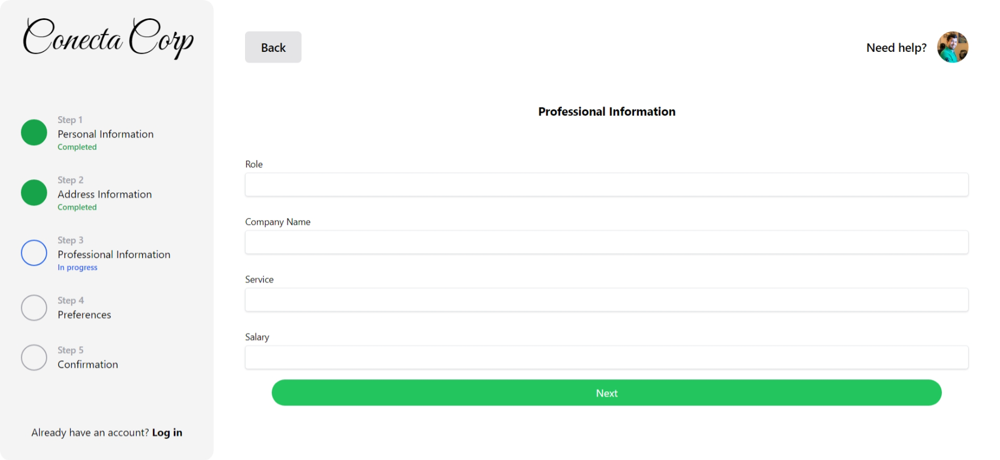
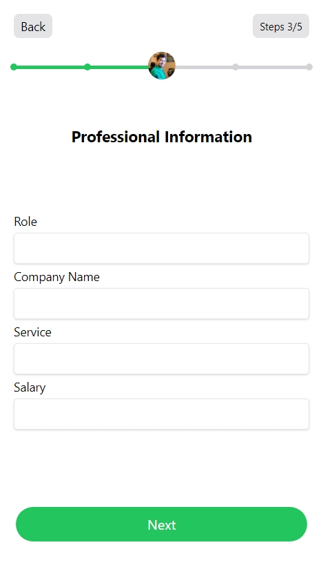

# Simple Multi-step Form React Project

A modern, user-friendly multi-step form built with React. This project demonstrates how to create an intuitive form workflow that breaks down complex data collection into manageable steps.

## 🌟 Preview

### Desktop Preview


### Mobile Preview
<div align="center">
  
</div>

## 🎯 Features

- Step-by-step form progression
- Form state management
- Validation between steps
- Responsive design
- Clean and modern UI using Tailwind CSS

## 🚀 Tech Stack

- **[Vite](https://vitejs.dev/)**: Selected as the build tool for its exceptional development experience and fast refresh capabilities, making form development and testing quick and efficient.

- **[Biome.js](https://biomejs.dev/)**: Ensures consistent code formatting and catches potential issues early in development. Its fast performance and comprehensive toolset help maintain high code quality across form components.

- **[Tailwind CSS](https://tailwindcss.com/)**: Enables rapid styling of form components with utility classes, making it easy to create a responsive and visually appealing form interface while maintaining consistency.

## 🛠️ Getting Started

### Prerequisites

* **Node.js** installed on your machine.

### Installation

```bash
# Clone the repository
git clone https://github.com/carlosedilsonjr/conecta-corp

# Navigate to project directory
cd conecta-corp

# Install dependencies
npm install
```

### Development

To start the development server:

```bash
npm run dev
```

## 📝 Available Scripts

- `npm run dev` - Runs the app in development mode
- `npm run build` - Builds the app for production
- `npm run preview` - Preview the production build locally
